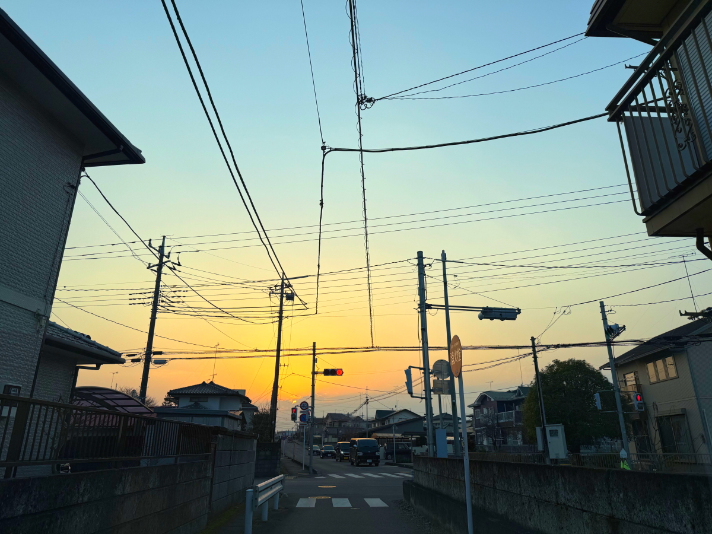
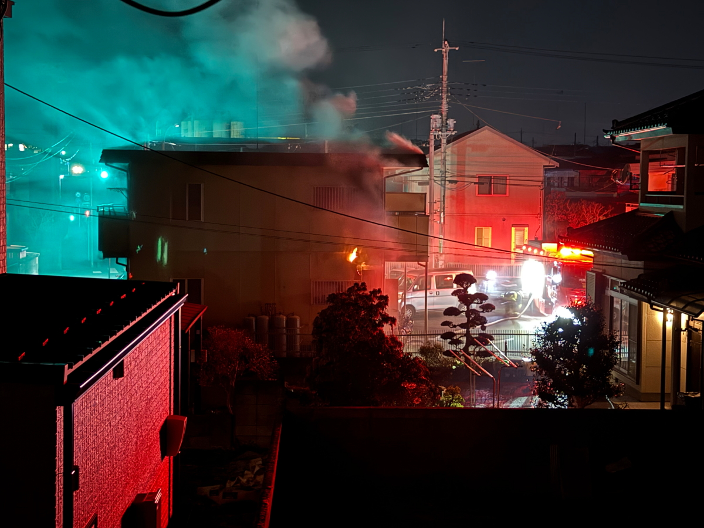
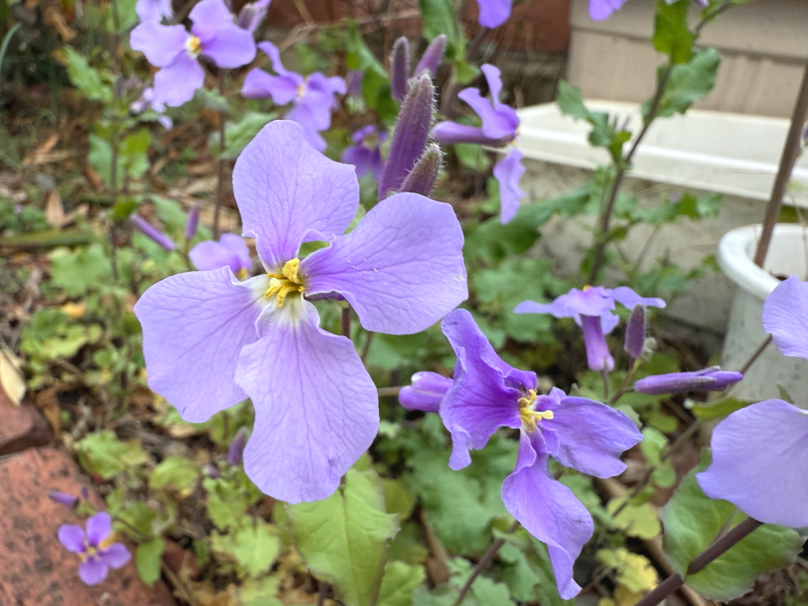
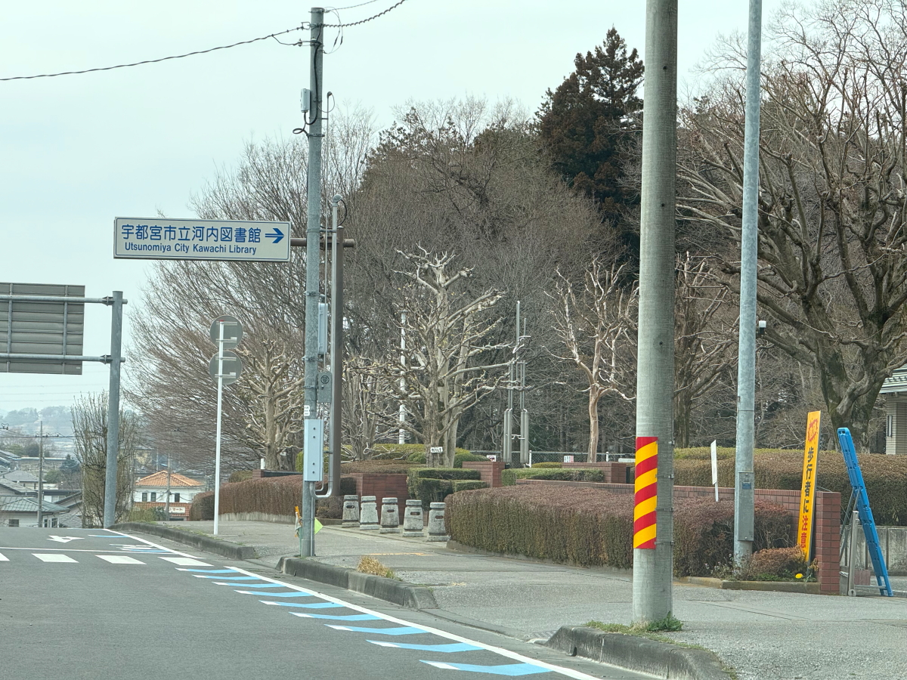
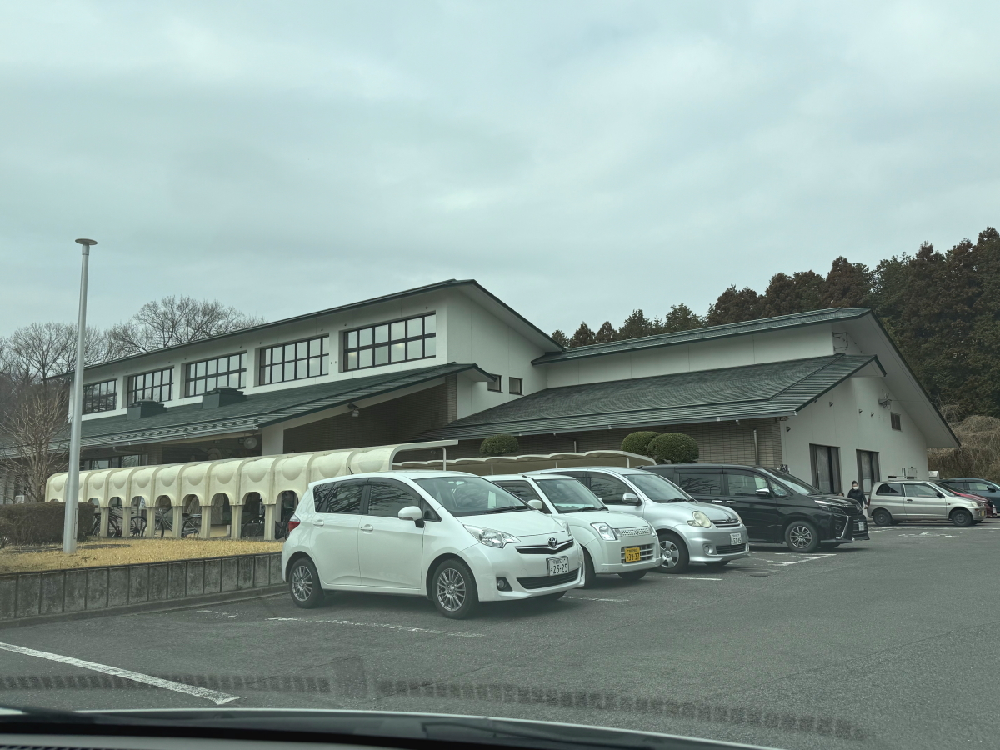

# 20250327_tochigi

<html>
<head>

<meta charset="UTF-8">
<meta http-equiv="Content-Type" content="text/html; charset=UTF-8">
<meta http-equiv="X-UA-Compatible" content="IE=EmulateIE10" />
<meta http-equiv="X-UA-Compatible" content="IE=edge">

<meta name="viewport" content="width=device-width, initial-scale=1.0">

<!--ここから上はお決まりの定型文です-->

<!--ここからが表現の書式などを決めるcssという部分-->

<link href="https://cdnjs.cloudflare.com/ajax/libs/lightbox2/2.7.1/css/lightbox.css" rel="stylesheet">

</head>

<body>

モバイル端末をお使いの場合は、画面を横向きにすると
より見やすくご覧頂けます。

<!--ここ上は、ほぼそのまま使います！-->

<!--QRコードの挿入例-->

 アクセス用QRコード

<marquee direction="left" scrollamount="20" width="30%">(^_^)/~alis</marquee>

<!--流れ文字の挿入例-->
<h1><marquee behavior="left">!!! 2025/03/25-27、1日が平穏に暮れたと思いきや深夜帯に火事!!!</marquee></h1>

                          

<!--ここから下が、本体部分-->

<h2>25日も西の空に夕焼け</h2>

    
<h2>深夜23時に消防車の音、なんと３件隣で火事</h2>

<h2>火事の動画はFaceBookに上がってます</h2>
<iframe src="https://www.facebook.com/plugins/post.php?href="https%3A%2F%2Fwww.facebook.com%2Fsatoshi.hada.12%2Fposts%2Fpfbid02jTEpe2tYu5VezyauT5aKr5qYzncjddrdZeCKCYeNAm1qqANVUa6dqomxBkHTvhcwl&show_text=true&width=500" width="500" height="0" ></iframe> 

 

<iframe src="https://www.facebook.com/plugins/post.php?href=https%3A%2F%2Fwww.facebook.com%2Fsatoshi.hada.12%2Fposts%2Fpfbid02jTEpe2tYu5VezyauT5aKr5qYzncjddrdZeCKCYeNAm1qqANVUa6dqomxBkHTvhcwl&show_text=true&width=500" width="500" height="0" style="border:none;overflow:hidden" scrolling="no" frameborder="0" allowfullscreen="true" allow="autoplay; clipboard-write; encrypted-media; picture-in-picture; web-share"></iframe>
 
    
<h2>翌日は気を取り直してカインズホームでお花を眺めます</h2>

    
<h2>タイのショッピングモールを見ちゃうと、こちらが狭く感じます</h2>

<h2>庭の端では紫花菜が満開中</h2>

    
<h2>川内図書館で画像処理してHP化</h2>

 

         

   
  
<h2>今日ã®BGM㯠Moments d’Amour 🵠French Romantic Songs to Fall in Love Again</h2>
<iframe width="560" height="315" src="https://www.youtube.com/embed/zw83gtO6VLI?si=vvF2nZPud8WTGYPX" title="YouTube video player" frameborder="0" allow="accelerometer; autoplay; clipboard-write; encrypted-media; gyroscope; picture-in-picture; web-share" referrerpolicy="strict-origin-when-cross-origin" allowfullscreen></iframe> 

<!--
  
<h2>ã‚‚ã†ä¸€ã¤ Cat Music🱠The Viral Cat Sound That Instantly Relaxes Your Feline | Global, Cat Therapy 再掲です</h2>
<iframe width="560" height="315" src="https://www.youtube.com/embed/DP3ou_KLEXc?si=bES7fqcpfwSwMR9k" title="YouTube video player" frameborder="0" allow="accelerometer; autoplay; clipboard-write; encrypted-media; gyroscope; picture-in-picture; web-share" referrerpolicy="strict-origin-when-cross-origin" allowfullscreen></iframe> 
-->

<!--
  
<h2>メタバース「cluster」内のイベントで「雪の約束」by まいてゃさん ダンサーの玖遠さんがトラブってみんなでステージダンスになりました</h2>
  
        <h2>MP4ファイルの再生</h2>
    <video controls width="640">
        <source src="2025-02-26 yukinoyakusoku by maitiya.mp4" type="video/mp4">
        お使いのブラウザは video タグをサポートしていません。
    </video>
-->

  
<h2>まいてゃさんアルバム MBG 2502 10kyoku 再掲です</h2>
<iframe width="560" height="315" src="https://www.youtube.com/embed/xVTSe-eXbFs?si=1YAnLelZqsU-zs0m" title="YouTube video player" frameborder="0" allow="accelerometer; autoplay; clipboard-write; encrypted-media; gyroscope; picture-in-picture; web-share" referrerpolicy="strict-origin-when-cross-origin" allowfullscreen></iframe> 
    
    
    <h3>「雪の中で輝くシンデレラ」by まいてゃ</h3>
<h2><a href="https://torokoid.github.io/20250219_chiangrai/maitiyaz.mp3" target="_blank">この文字クリックで再生します 下の再生ボタンでも同じ曲をループ再生します</a></h2>

    <audio controls loop>
        <source src="https://torokoid.github.io/20250219_chiangrai/maitiyaz.mp3" type="audio/mpeg">
        お使いのブラウザは audio タグをサポートしていません。
    </audio>

    
<!--
  
<h2>スティーブ・ジョブズの伝説の講義</h2> 
<iframe width="560" height="315" src="https://www.youtube.com/embed/XsRpvWHIVw0?si=f7IA0pv9iZWVk3VH" title="YouTube video player" frameborder="0" allow="accelerometer; autoplay; clipboard-write; encrypted-media; gyroscope; picture-in-picture; web-share" referrerpolicy="strict-origin-when-cross-origin" allowfullscreen></iframe>    
    
    
<h2>スティーブ・ジョブズ氏の講義の内容が「笑って死ぬ」by まいてゃ さんの歌の内容と大筋で同じに聞こえます 以下に再掲しますね</h2>

    
<h3>歌の後半部分しか撮れてませんが、2月16日のイベントで公開された「笑って死ぬ」 by まいてゃ 白ドレスはダンサーの玖遠さん、黒いドレスがまいてゃさん</h3>
<iframe width="560" height="315" src="https://www.youtube.com/embed/s4ZcbxAluMM?si=Xa32xo19UCNaWv0v" title="YouTube video player" frameborder="0" allow="accelerometer; autoplay; clipboard-write; encrypted-media; gyroscope; picture-in-picture; web-share" referrerpolicy="strict-origin-when-cross-origin" allowfullscreen></iframe> 
-->
    

    <h3>お気に入りの「笑って死ぬ」 by まいてゃさんも再々掲です</h3>
<h2><a href="https://torokoid.github.io/20250221_chiangrai/maitiya3.mp3" target="_blank">この文字クリックで再生します 下の再生ボタンで同じ曲をループ再生します</a></h2>

    <audio controls loop>
        <source src="https://torokoid.github.io/20250221_chiangrai/maitiya3.mp3" type="audio/mpeg">
        お使いのブラウザは audio タグをサポートしていません。
    </audio>

   
<h2>以上、深夜帯の近所の火事で驚いた宇都宮の一日でした。 ここまでご覧いただきありがとうございました。</h2>

     
<h2>
<a href="https://torokoid.github.io/Mashiko_himawari_3/" target="_blank">クリックでメニューページに戻ります</a>
</h2>

   

         

  

      

<!--本体はここまで-->

<!--画面に空白地帯を作って、背景が見えるようにしています-->
                                              

<!-- フッタ -->
<footer>

Copyright 2025/03/27 alis @Tochigi

</footer>

<!--HPにさまざまなJavaScriptを呼び込むための書式-->

    
    </body>
    
</html>
